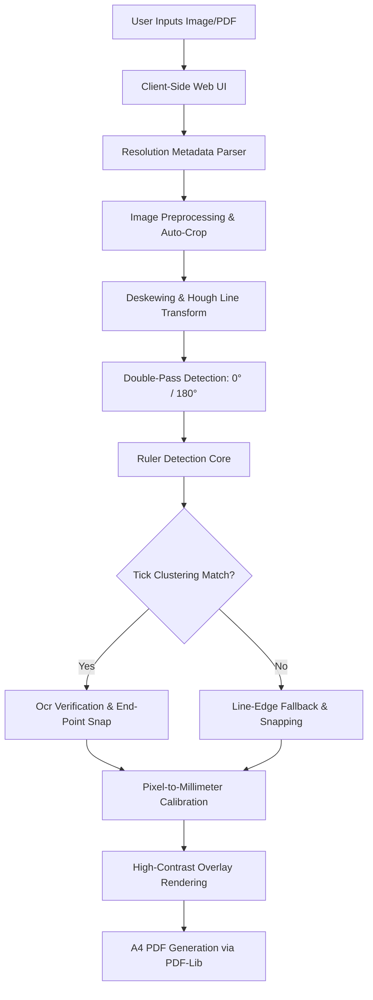
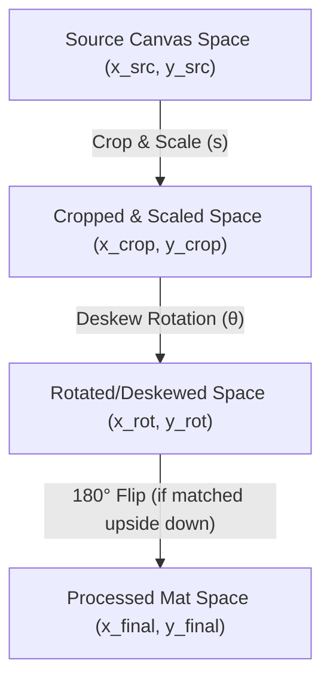

# Stoma Stencil Scaler — Technical Architecture

This document provides a comprehensive overview of the **Stoma Stencil Scaler** architecture, its image processing pipeline, core mathematical algorithms, and testing philosophy. It serves as a guide for developers and AI agents to understand the repository structure and algorithm inner workings in minutes.

---

## 1. System Overview

The Stoma Stencil Scaler is a **client-side web application** that processes scans or photographs of physical stoma measurement stencils, detects an on-stencil ruler, and outputs a print-ready, high-resolution PDF scaled precisely **1:1 (100%)** on an A4 sheet.



---

## 2. Codebase Organization

The repository has been cleaned of clutter and temporary files, establishing a simple and logical layout:

```
stoma_stencils/
├── ARCHITECTURE.md                  # This detailed architectural guide
├── README.md                        # Project introduction, features, and setup
├── FILE_MAPPING.md                  # Mapping of test stencils to anonymized files
├── BUILD_REQUIREMENTS.md            # Detailed instructions for local production builds
├── index.html                       # Single-page application template
├── js/
│   ├── app.js                       # Frontend UI event handler and state controller
│   ├── gui_pipeline.js              # Image preparation pipeline (crop → deskew → rotate)
│   ├── image-utils.js               # OpenCV helpers: deskew, rotateWithFrame, cropAndScale
│   ├── pdf-generator.js             # A4 PDF generation via PDF-Lib
│   └── ruler-detector.js            # Core ruler-detection and alignment algorithm
├── offline_package/                 # Self-contained offline bundle (mirrors js/ + vendor/)
├── backup_algo/                     # Safety backups of earlier algorithm versions
├── dataset/                         # Offline development and training dataset
├── test_outputs/                    # Flat directory structure for E2E test previews
│   ├── match/                       # Successfully matched stencil previews
│   ├── not_match/                   # Stencils with out-of-bounds scale deviations
│   ├── unsure/                      # Stencils with failed automated detections (fallback)
│   └── report.md                    # Generated detailed test report
├── test_results.md                  # High-level E2E test results summary
├── ruler_ground_truth.json          # Human-verified ruler endpoint coordinates per stencil
├── run_direct_tests.js              # Command-line Node.js runner for E2E test validation
├── package.json                     # Node development dependencies configuration
└── vendor/                          # Local offline JS vendor libraries (OpenCV, Tesseract, etc.)
```

---

## 3. The 5-Stage Image Processing Pipeline

When a file is loaded (either via the Web UI or through the CLI E2E test runner), it goes through five consecutive processing stages:

### Stage 1: Input & Adaptive Auto-Crop
1. **Resolution Extraction**: For PDF files, page dimensions are read in points (72 DPI) to extract a target baseline physical scale. For JPEGs/PNGs, resolution metadata (DPI) is extracted if available.
2. **Auto-Crop (Contour Analysis)**: To handle smartphone photos with heavy background clutter, the system runs OpenCV contour extraction. If a dominant candidate contour representing the stencil card is found (covering $10\% \text{ to } 98\%$ of the canvas area), it is cropped and padded symmetrically by $30\%$.
3. **High-Res Upscaling**: If the cropped image is low-resolution (e.g., $<2000\text{px}$ wide), it is upscaled using bicubic interpolation (`cv.INTER_CUBIC`) to improve tick detection and Tesseract OCR precision.

### Stage 2: Deskewing & Rotation (Hough Transform)
Physical scans and photographs are frequently misaligned. To rectify rotation:
1. **Edge Extraction**: The image is converted to grayscale, blurred with a Gaussian kernel ($3 \times 3$), and run through a **Canny filter** (thresholds: 50, 150) to detect sharp edges.
2. **Hough Lines**: A Progressive Probabilistic Hough Transform (`cv.HoughLinesP`) is run to detect straight segments longer than $25\%$ of the image width.
3. **Median Angle Deskewing**: Angles of all near-horizontal ($-35^\circ \le \theta \le 35^\circ$) and near-vertical lines are collected. The **median angle** is used to rotate the image. White border padding is added to prevent clipping.

### Stage 3: Double-Pass Ruler Detection (0° and 180°)
The detected ruler could be oriented right-side-up or upside-down ($180^\circ$ rotated). The system clones the deskewed matrix and performs detection on both the **normal orientation** and a **$180^\circ$ rotated copy**. It then scores and compares candidates to find the correct orientation.

#### Core Ruler-Detection Methods:
- **Tick Clustering (Primary)**: Groups short, parallel lines (ticks) perpendicular to the ruler axis using spatial clustering. By analyzing the density peaks of these clusters, it finds the optimal line representing the 0-to-10 cm or 0-to-12 cm scale.
- **OCR Scan & Verification**: Tesseract.js scans the ruler bounding box to find digits (`0`, `10`, `12`). If these digits are found near the detected line endpoints, the detection is classified as highly reliable (`lineReliable = true`).
- **Edge Line Fallback (Backup)**: If tick clustering fails (due to low contrast or blur), the system falls back to finding the longest plausible horizontal/vertical line within expected coordinates.

### Stage 4: Pixel-to-Physical-Scale Calibration
Once the endpoints of the ruler ($P_0$ and $P_{12}$) are found, the physical scale is established:
$$\text{Scale Ratio } (px/\text{mm}) = \frac{\text{Distance}(P_0, P_{12})}{\text{Ruler Length in mm}}$$

Using this ratio, the physical dimensions of the active image are computed:
$$\text{Physical Width (mm)} = \frac{\text{Image Width (px)}}{\text{Scale Ratio}}$$
$$\text{Physical Height (mm)} = \frac{\text{Image Height (px)}}{\text{Scale Ratio}}$$

### Stage 5: Premium A4 PDF Generation
The application uses **PDF-Lib** to render the scaled template on an standard A4 canvas ($210 \times 297 \text{ mm}$):
1. **Standard Margin**: A $10\text{ mm}$ safety margin is enforced to prevent printers from clipping artwork.
2. **DPI Compensation**: Image layers are rendered inside the PDF standard point space ($1\text{ pt} = 1/72\text{ inch} = 0.3527\text{ mm}$) to achieve a flawless $1:1$ reproduction.
3. **Aspect Ratio Lock**: High-resolution layouts are positioned dynamically in the center of the sheet, preserving exact physical dimensions.

---

## 4. Algorithmic Deep Dive

### A. Tick Clustering & Spacing Estimation
Rulers consist of repetitive ticks. The system detects tick marks by projecting horizontal/vertical line density:
1. A bounding region is scanned using a sliding window.
2. The frequency and spacing of local maximum pixel intensities representing ticks are modeled via a **Kernel Density Estimation (KDE)**-like 1D histogram.
3. The system finds the dominant spatial frequency $f$ (pixels per millimeter).
4. The estimated ruler length is calculated:
$$\text{Estimated Span} = L_{\text{ruler}} \times f$$

### B. Grid Fitting & Snap-to-Endpoint
To achieve sub-pixel precision, the system snaps endpoints to the exact edges of the 0 cm and 10/12 cm ticks:
- **Major Ticks Grid Fitting**: A multi-candidate optimization loop tests candidate starting positions ($S_i$) and spacings ($D_j$).
- **Score Function**: Candidates are scored by how many detected ticks align with the simulated millimeter grid.
- **Drift Penalization**: Shifts relative to the initial seed start are penalized. High-confidence OCR seeds bypass hard constraints to allow correct alignment on shifted stencils (such as Stencil 1, which has a 1 cm shift).

### C. Advanced Optimization & Parity Features

1. **Adaptive Grid Match Threshold**: On low-resolution or high-contrast millimeter grids (where `centers.length >= 45` but only centimeter marks are clearly extracted), the maximum mathematical ratio of matches to simulated grid coordinates is bounded at approximately $10\%$. By introducing an adaptive threshold $\text{limitRatio} = \text{isCmOnly} ? 0.22 : 0.08$ in `candidateFromTicks()`, the algorithm allows millimeter-grid trackers to securely lock onto these centimeter-only clusters without losing scaling accuracy.
2. **Auto-Length Selector**: To establish complete parity between programmatic tests and HTML/GUI browser uploads, the frontend runs `detectExpectedRulerLengthFromFilename()`. When files matching stencils `1, 2, 3, 4, 5, 16` or keywords like `publicare`, `0-10`, `spontantest` are loaded, the UI dropdown automatically adapts to `10 cm`, guaranteeing correct geometry matching before any processing starts.
3. **Canvas Tick Scaling**: To resolve anti-aliasing transparency in high-resolution canvas views, tick lengths are scaled dynamically relative to the canvas dimensions: $\text{cmLength} = \max(20, \text{round}(\max(W, H) / 80))$. Strict line widths are enforced (minimum $2\text{px}$ for millimeter ticks, $3.5\text{px}$ for half-centimeter, and $5\text{px}$ for centimeter ticks) ensuring crisp visual lines.
4. **Unified Calibration API Endpoint**: The FastAPI backend exposes a single, atomic `/api/save-calibration` route. This route accepts form-data, writes the JPEG file to `dataset/images/`, writes the YOLOv8 Pose annotations to `dataset/labels/`, registers UUID mappings, and updates `ruler_ground_truth.json` concurrently to prevent any desynchronization between dataset collection and ground-truth validations.

---

## 5. Automated E2E Testing Framework

The repository features a lightning-fast E2E test runner (`run_direct_tests.js`) that runs fully offline on macOS using OpenCV.js under Node.js:

1. **Ground Truth Validation**: Uses `ruler_ground_truth.json` containing precise ruler endpoint coordinates per stencil file.
2. **GT Coordinate Space**: Coordinates are stored in **processed-mat space** — i.e., the same frame used by the detector output (after crop, scale, and deskew). No further transform is applied at comparison time.
3. **Orientation-Invariant Comparison**: The detector runs on both the normal and 180°-rotated mat and picks the higher-scoring candidate. GT comparison tests both the stored orientation and its 180°-flip equivalent (`W - x`, `H - y`) and takes the minimum error, so MATCH holds regardless of which candidate mat wins on any given run.
4. **Maximum Allowable Deviation**: A strict **$1.5 \text{ mm}$ error margin** is enforced on the parallel calibration axis. Any deviation above this threshold triggers a `NOT MATCH` status and a non-zero exit code.
5. **Updating Ground Truth**: GT entries must reflect current detector output in current pipeline conditions. When the pipeline changes (e.g., crop parameters, deskew angle, rendering DPI), affected entries should be refreshed by running the targeted stencil with `[DETECTED]` logging and writing the new coordinates.

---

## 6. Coordinate Spaces & Calibration Acceptance Criteria

To guarantee precision and prevent geometric regressions, we define clear coordinate frames and error acceptance rules.

### 6.1 Coordinate Space Transformation Pipeline

Images and PDF inputs undergo a sequence of spatial transformations. Any coordinate point transforms as follows from the source file to the final detection canvas:



#### Mathematical Transforms

1. **Source Canvas Frame**:
   Represents raw pixels of the uploaded image or the high-resolution PDF viewport canvas (rendered at `scale = 3.0` for $216$ DPI). Coordinates are defined as $(x_{\text{src}}, y_{\text{src}})$.

2. **Cropped & Scaled Frame**:
   The bounding box of the auto-crop area begins at $(\text{cropX}, \text{cropY})$ relative to the source canvas. The image is cropped and then scaled by factor $s$ (e.g., upscaling low-res views for tick/OCR accuracy):
   $$x_{\text{crop}} = (x_{\text{src}} - \text{cropX}) \cdot s$$
   $$y_{\text{crop}} = (y_{\text{src}} - \text{cropY}) \cdot s$$

3. **Rotated (Deskewed) Frame**:
   The cropped mat is deskewed by rotating it by $\theta$ degrees around its center $(c_x, c_y)$. Because rotation expands the canvas size to prevent cropping boundary clipping, the rotation maps points to the new expanded frame center $(c'_x, c'_y)$:
   $$\begin{bmatrix} x_{\text{rot}} \\ y_{\text{rot}} \end{bmatrix} = \begin{bmatrix} \cos\theta & -\sin\theta \\ \sin\theta & \cos\theta \end{bmatrix} \begin{bmatrix} x_{\text{crop}} - c_x \\ y_{\text{crop}} - c_y \end{bmatrix} + \begin{bmatrix} c'_x \\ c'_y \end{bmatrix}$$
   Where the new dimensions $(W_{\text{new}}, H_{\text{new}})$ are computed as:
   $$W_{\text{new}} = \lceil H_{\text{crop}} \sin|\theta| + W_{\text{crop}} \cos|\theta| \rceil$$
   $$H_{\text{new}} = \lceil H_{\text{crop}} \cos|\theta| + W_{\text{crop}} \sin|\theta| \rceil$$

4. **Active/Processed Mat Frame (180° Rotation-Flip)**:
   If the detector determines the ruler scale is upside down, a $180^\circ$ rotation is applied to the active mat:
   $$x_{\text{final}} = W_{\text{final}} - x_{\text{rot}}$$
   $$y_{\text{final}} = H_{\text{final}} - y_{\text{rot}}$$

This final active frame matches the preview overlay output, which is why ground-truth coordinates in `ruler_ground_truth.json` are stored directly in this **processed-mat space** to maintain absolute validation simplicity.

### 6.2 Parallel vs. Perpendicular Acceptance Criteria

When evaluating whether the detected ruler coordinates ($P_0$, $P_{12}$) match the ground-truth ticks, we must accommodate human-clicking and tick-height variance. A perpendicular offset of a few millimeters does not affect the physical scaling calibration (pixels/mm) or the deskew angle of the output. Therefore, the E2E verification decomposes the deviation into two components:

1. **Directional Ground-Truth Vectors**:
   Let the Ground Truth vector be $\vec{v} = P_{12}^{GT} - P_{0}^{GT}$, with total length $\lVert \vec{v} \rVert$ in pixels. The target physical span length is $gtLenMm$ (e.g. $100\text{ mm}$ or $120\text{ mm}$).
   The unit tangent vector is $\vec{u} = \frac{\vec{v}}{\lVert \vec{v} \rVert}$, and the unit normal vector is $\vec{n} = (-u_y, u_x)$.

2. **Optimal Translation Alignment**:
   To prevent penalty for simple horizontal translation shifts along the scale line, we project the detected segment onto the ground-truth line. The optimal offset projection $offsetMm$ along the axis is:
   $$offsetMm = \frac{\vec{v} \cdot (\vec{dp}_0 + \vec{dp}_{12})}{2 \lVert \vec{v} \rVert^2}$$
   Where $\vec{dp}_0 = P_0 - P_0^{GT}$ and $\vec{dp}_{12} = P_{12} - P_0^{GT} - \text{snapMm} \cdot \vec{v}$ (here $snapMm$ is the detected ruler length).

3. **Expected Coordinates**:
   Using the projected shift, the target expected endpoints are:
   $$P_0^{\text{exp}} = P_0^{GT} + offsetMm \cdot \vec{v}$$
   $$P_{12}^{\text{exp}} = P_0^{GT} + (offsetMm + snapMm) \cdot \vec{v}$$

4. **Error Metrics**:
   - **Parallel Error ($err_{\parallel}$)**: Measures physical scale length calibration deviation.
     $$err_{\parallel, 0} = |(P_0 - P_0^{\text{exp}}) \cdot \vec{u}|$$
     $$err_{\parallel, 12} = |(P_{12} - P_{12}^{\text{exp}}) \cdot \vec{u}|$$
     $$\text{maxParErrMm} = \frac{\max(err_{\parallel, 0}, err_{\parallel, 12})}{\lVert \vec{v} \rVert}$$
   - **Perpendicular Error ($err_{\perp}$)**: Measures distance offset normal to the ruler axis.
     $$err_{\perp, 0} = |(P_0 - P_0^{\text{exp}}) \cdot \vec{n}|$$
     $$err_{\perp, 12} = |(P_{12} - P_{12}^{\text{exp}}) \cdot \vec{n}|$$
     $$\text{maxPerpErrMm} = \frac{\max(err_{\perp, 0}, err_{\perp, 12})}{\lVert \vec{v} \rVert}$$

5. **Decision Logic**:
   - **Strict Parallel Axis Margin**: We enforce a strict **$< 1.5\text{ mm}$** parallel calibration deviation limit.
   - **Lenient Perpendicular Axis Margin**: If the perpendicular offset is within **$3.5\text{ mm}$**, we ignore the perpendicular offset entirely and return `maxParErrMm`.
   - **Off-Axis Penalty**: If the ruler detection is shifted off-axis by more than $3.5\text{ mm}$, the test fails by returning the maximum of the two: $\max(\text{maxParErrMm}, \text{maxPerpErrMm})$.

